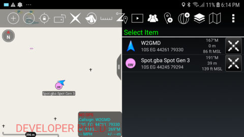

spotcot - Spot Cursor-on-Target Gateway.
****************************************

`spotcot` is a command-line utility for converting Spot Messages into
Cursor on Target (CoT) Events. Events are then forwarded to a specified UDP
Host:Port pairing.

Can be used to display Spot device PLI in tools such as ATAK, WinTAK &
RaptorX. See https://www.civtak.org/

Requires Spot device
Requires the XML Feed Feature of the Spot service. See
 https://login.findmespot.com/spot-main-web/myaccount/xmlfeed/create.html

Installation
============

Requirements:

1. Spot XML Feed ID ('API Key')
2. This package.

Steps:

The command-line daemon `spotcot` can be install from this source tree (A), or from
the Python Package Index (PyPI) (B).

A) To install from this source tree::

    $ git checkout https://github.com/ampledata/spotcot.git
    $ cd spotcot/
    $ python setup.py install

B) To install from PyPI::

    $ pip install spotcot

Usage
=====

The `spotcot` daemon has several runtime arguments::

    $ spotcot -h
    usage: spotcot [-h] -k API_KEY [-i INTERVAL] -C COT_HOST

    optional arguments:
      -h, --help            show this help message and exit
      -k API_KEY, --api_key API_KEY
                            Spot API Key ("XML Feed Id")
      -i INTERVAL, --interval INTERVAL
                            Spot API Query Interval
      -C COT_HOST, --cot_host COT_HOST
                            Cursor-on-Target Host or Host:Port

For minimum operation, `-k API_KEY` & `-C COT_HOST` are required.

Build Status
============

Master:

.. image:: https://travis-ci.com/ampledata/spotcot.svg?branch=master
    :target: https://travis-ci.com/ampledata/spotcot

Develop:

.. image:: https://travis-ci.com/ampledata/spotcot.svg?branch=develop
    :target: https://travis-ci.com/ampledata/spotcot

Source
======
Github: https://github.com/ampledata/spotcot

Author
======
Greg Albrecht W2GMD oss@undef.net

http://ampledata.org/

Copyright
=========
Copyright 2020 Orion Labs, Inc.

License
=======
Apache License, Version 2.0. See LICENSE for details.

Debugging Cursor-on-Target
==========================
The publicly available ATAK source was a good reference for some of the parsing
errors the ATAK-Civ Development Build was giving me, namely `Invalid CoT
message received: Missing or invalid CoT event and/or point attributes`. Many
errors are unfortunately caught in a single try/catch block:

https://github.com/deptofdefense/AndroidTacticalAssaultKit-CIV/blob/6dc1941f45af3f9716e718dccebf42555a8c08fd/commoncommo/core/impl/cotmessage.cpp#L448

Debugging Spot Messages
=======================

Example response::

    {
      "response": {
        "feedMessageResponse": {
          "count": 2,
          "feed": {
            "id": "0DHc3pHDeJlq4kz6bHx5jW1QfzKlsWt7W",
            "name": "spotcot",
            "description": "spotcot",
            "status": "ACTIVE",
            "usage": 0,
            "daysRange": 7,
            "detailedMessageShown": true,
            "type": "SHARED_PAGE"
          },
          "totalCount": 2,
          "activityCount": 0,
          "messages": {
            "message": [
              {
                "@clientUnixTime": "0",
                "id": 1480220691,
                "messengerId": "0-3032366",
                "messengerName": "gba Spot Gen 3",
                "unixTime": 1601691600,
                "messageType": "UNLIMITED-TRACK",
                "latitude": 37.7599,
                "longitude": -122.49768,
                "modelId": "SPOT3",
                "showCustomMsg": "Y",
                "dateTime": "2020-10-03T02:20:00+0000",
                "batteryState": "GOOD",
                "hidden": 0,
                "altitude": 23
              },
              {
                "@clientUnixTime": "0",
                "id": 1480218901,
                "messengerId": "0-3032366",
                "messengerName": "gba Spot Gen 3",
                "unixTime": 1601691300,
                "messageType": "UNLIMITED-TRACK",
                "latitude": 37.75999,
                "longitude": -122.49779,
                "modelId": "SPOT3",
                "showCustomMsg": "Y",
                "dateTime": "2020-10-03T02:15:00+0000",
                "batteryState": "GOOD",
                "hidden": 0,
                "altitude": -103
              }
            ]
          }
        }
      }
    }
